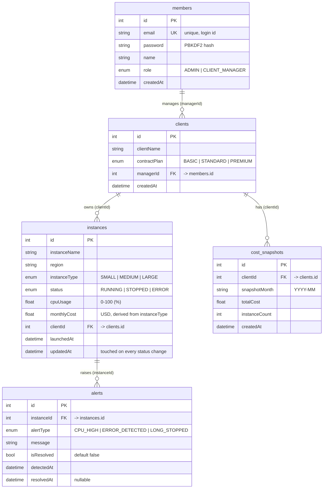

# Step 1 — ERD Design

## Entity Relationship Diagram

## Relationships

| Relationship | Cardinality | Notes |
|---|---|---|
| members → clients | 1 : N | A CLIENT_MANAGER is responsible for zero or more clients; every client has exactly one manager. |
| clients → instances | 1 : N | Each cloud instance belongs to exactly one client company. |
| instances → alerts | 1 : N | Monitoring endpoints auto-record alerts against instances. |
| clients → cost_snapshots | 1 : N | One snapshot per client per month for historical cost tracking. |

## Design Notes

- **Column names use camelCase** to mirror the assignment specification exactly (`createdAt`, `managerId`, `cpuUsage`, ...).
- **`monthlyCost` is derived** from `instanceType` at registration time using the unit pricing table (SMALL $50 / MEDIUM $120 / LARGE $250) but stored for reporting speed and historical accuracy if pricing changes.
- **`updatedAt`** is refreshed on every status change; it drives both the *long-stopped (48h+)* detection and the SLA uptime approximation (the schema has no status-history table, so the last transition time is the best available signal).
- **`alerts.isResolved` + `resolvedAt`** support the dedup rule: monitoring calls skip alert creation when an unresolved alert of the same type already exists for the instance.
- **`cost_snapshots.snapshotMonth`** is stored as a `YYYY-MM` string for simple grouping and uniqueness per client-month.
